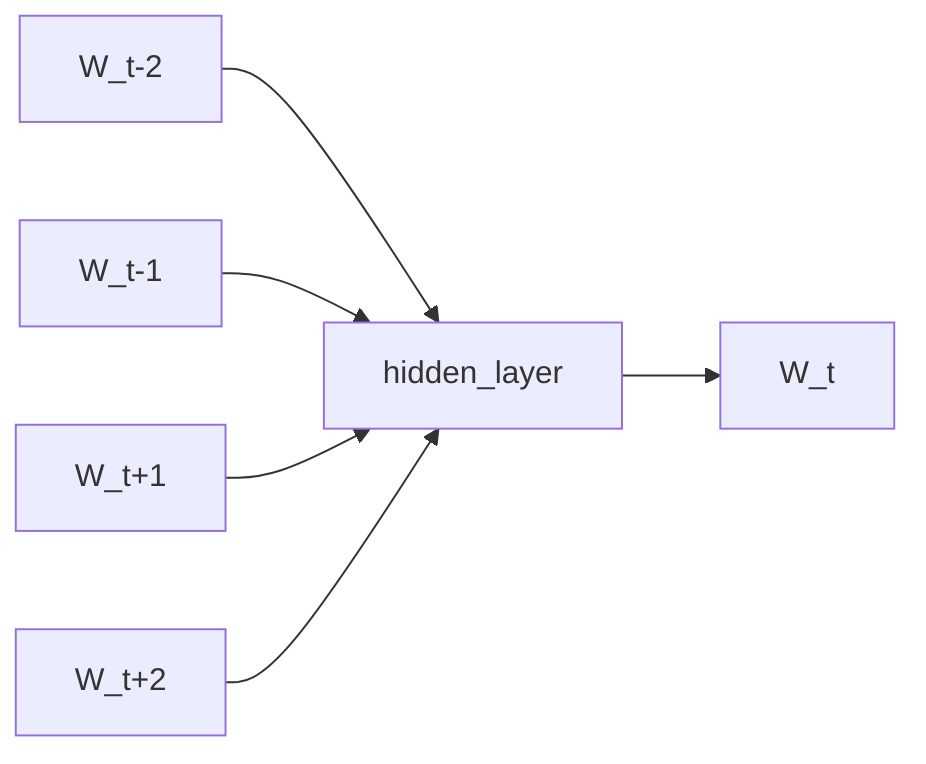
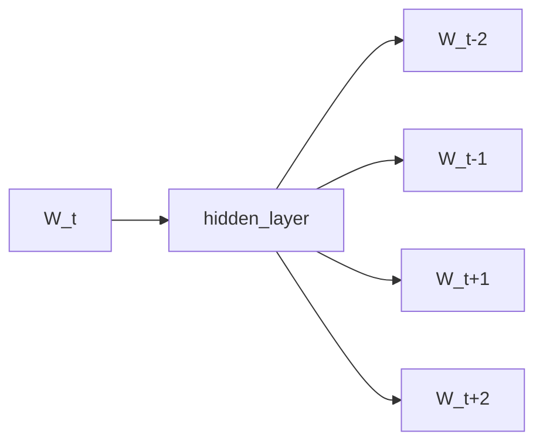

* content
{:toc}

## 概述

**论文地址[2017]**：[Attention Is All You Need](https://arxiv.org/pdf/1706.03762.pdf)

**核心运算**：$ Attention(Q,K,V) = softmax(\frac{QK^T}{\sqrt{d_k}})V $

**描述**：查询(Query)到键值(Key-Value)的映射

<!--more-->

## 模型结构

## Embedding

$$
X_{[batch\_size, seq\_len]} => X_{embedding[batch\_size,seq\_len, em\_dim]}
$$

向量嵌入，其中`batch_size`可理解为句子数量，`seq_length`可理解为单个句子的字数，`embedding dimension`为向量长度。

Embedding做的事情就是：将句子中的字转换成向量形式。

每个字对应的向量由`Word2vec`算法而定。

#### Word2vec

Word2vec由简单的神经网络模型生成，一般分两种：`CBOW(Continuous Bag-of-Words)`与`Skip-Gram`。

* CBOW输入是某个词的上下文词向量，输出是该词的词向量。适合小型数据量。如下图：

* Skip-Gram输入是某个词的词向量，输出是上下文的词向量。适合大型数据量。如下图：

## Positional Encoding

$$
PE_{(pos, 2i)} = sin(pos/10000^{2i/d_{model}}) \\
PE_{(pos, 2i+1)} = cos(pos/10000^{2i/d_{model}}) \\
X_{embedding}\ += PositionEncoding(X_{embedding})
$$

位置嵌入，由于`self-attention`运算后会使X的位置信息丢失，需要嵌入位置。

* pos：指字的位置，范围[0, max\_sequence\_length)
* i：指字的维度，范围[0, embedding dimension)
* dmodel：这里对应embedding dimension

## Self-Attention

$$
Attention(Q,K,V) = softmax(\frac{QK^T}{\sqrt{d_k}})V \\
Q = Linear(X_{em}) = X_{em}W_Q \\
K = Linear(X_{em}) = X_{em}W_K \\
V = Linear(X_{em}) = X_{em}W_V
$$

通常$ d_k = d_v = embedding\_dim $，细节说明如下：

* Q,K,V对应quary,key,value

* &radic;dk用于调节，使softmax输入为标准正态分布。Q和K的各个分量是标准归一化分布，也就是均值为0，方差为1。QKT 得到的结果，均值为0，方差为dk。

* QKT  称注意力矩阵，维度为`[batch_size, h, seq_len, seq_len]`，Q与K对应向量越相似值越大，softmax后越大的值百分比越高

* 经过线性变换后Q,K,V的维度依然是`[batch_size, seq_len, em_dim]`，Attention之后的维度为`[batch_size, seq_len, em_dim]`

* 由于语句有长有短，需要masking操作使超出部分无效。

#### multi head attention

$$
head_i = Attention(QW_i^Q, KW_i^K, VW_i^V) \\
MultiHead(Q,K,V) = Linear(Concat(head1, ..., head_h)W^O)
$$

将`embedding dim`平均拆分成多份：`head size = embedding dim / num of heads`。

这样Q,K,W的维度为`[batch_size, h, seq_len, em_dim/h]`。

然后与V点积后维度为`[batch_size, h , seq_len, em_dim/h]`。

## 残差与归一化

$$
X_{res} = X_{em}+ Attention(Q,K,V) \\
X_{attention} = LayerNorm(X_{res}) = \alpha \odot \frac{X_{ij}-\mu_i}{\sqrt{\sigma_i^2 + \epsilon}} + \beta
$$

防止梯度消失，加快收敛

## 前馈网络

$$
FFN(x) = max(0, xW_1 + b_1)W_2 + b_2 \\
Res\ and\ LayerNorm
$$

线性映射和激活函数Pooling，然后再残差与归一化

## 循环重复

从`Self-Attention`到`前馈网络`循环操作

## 参考

[硬核图解Transformer](https://mp.weixin.qq.com/s/jx-2Ai2YKbwODW6uJaF3hQ)

[《Attention is All You Need》浅读（简介+代码）](https://kexue.fm/archives/4765)

